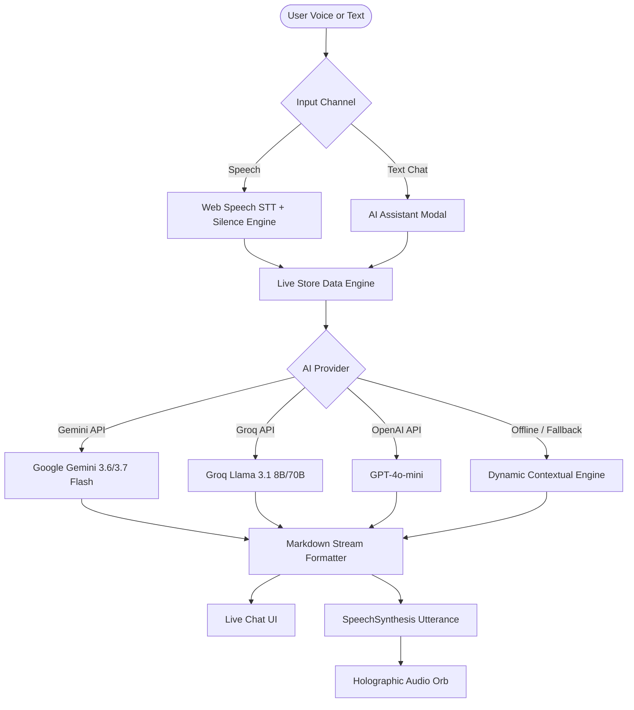

# ✨ HER — The Self-Assistance & Becoming Life Platform

<div align="center">


<br/>

> *"Become who you want to be. One ordinary day at a time."*

A luxury editorial personal operating system, self-assistance companion, and growth platform designed to make personal development feel aspirational, mindful, and grounded.

[Features](#-key-features) • [AI & Voice Architecture](#-ai--mark-liii-voice-architecture) • [Getting Started](#-getting-started) • [Configuration](#-api-keys--configuration) • [Project Structure](#-project-structure) • [Design System](#-design-system)

</div>

---

## 📖 Overview

**HER** combines high-fashion luxury editorial aesthetics with an intelligent personal operating system. Rather than feeling like a rigid corporate productivity tracker, HER creates an environment where personal rituals, habit consistency, deep work, and identity transformation flow effortlessly.

Built with **Vite**, **Vanilla ES6 Modules**, **Web Audio API**, and **Real-Time Multi-Model AI Streaming** (Google Gemini 3.6/3.7/2.5/Flash, Groq Llama 3.1 8B/70B, and OpenAI ChatGPT).

---

## 🌟 Key Features

### 1. 🪷 Daily Operating System (My Day)
- **Daily Promise to Herself**: Set one non-negotiable daily promise (*Kept / Partial / Not Today*) with Grace tracking.
- **Top 3 Priority Focus**: High-leverage task management with interactive completion states.
- **4-Pillar Presence Scoring**: Real-time calculated Presence Index across four holistic life dimensions:
  - 🧠 **Mind & Clarity** (Meditation, journaling, screen-free mornings)
  - 🏃‍♀️ **Body & Movement** (Pilates, hydration, walks, nourishing food)
  - 📚 **Future & Deep Study** (Coding sprints, research, skill building)
  - 🌿 **Self Care & Reset** (Skincare, evening wind-down, boundary keeping)

### 2. 🤖 HER AI Companion & Real-Time App Context
- **Full Dashboard Visibility**: HER AI has direct, real-time awareness of your active tasks, checklist completions, habit consistency scores, and 90-day goal milestones.
- **Multi-Model Intelligence**: Seamless switching between **Google Gemini (Gemini 3.6 Flash / 3.7 Flash)**, **Groq Llama 3.1**, and **OpenAI GPT-4o-mini**.
- **Real-Time Streaming & Speech-to-Text**: Live SSE streaming responses with instant speech recognition microphone input.

### 3. 🎙️ Mark-LIII Autonomous Holographic Voice Mode
- **Hands-Free Conversational Voice**: Talk aloud directly with HER.
- **Mic Isolation & Anti-Self-Hearing**: Real-time microphone muting while speaking to prevent feedback loops.
- **Synthesized Web Audio Chimes**: Custom harmonic audio feedback frequencies for wake, start, response, and completion events.
- **Glow Holographic Visualizer**: Dynamic Web Audio API frequency analyser orb that pulses to live voice audio.

### 4. ☕ Lifestyle Micro-Experiences (Live Section)
- Curated aesthetic micro-experience cards (*Morning espresso, golden hour walks, gallery visits, slow reading*).
- Photo uploads, reflections, tag filtering, and experiential completion milestones.

### 5. 🎯 90-Day Goal Architecture
- **3-Phase Goal Milestones**:
  - *Phase 1*: Foundations & Habit Architecture
  - *Phase 2*: Focused Execution & Deep Sprints
  - *Phase 3*: Polish, Ship & Reflection
- Progress calculation and immediate next-action recommendations.

### 6. 📈 Habit Tracker with Grace System
- Consistency percentage scoring instead of punitive streak breaks.
- Monthly day-by-day matrix and visual momentum meters.

### 7. 🌅 Morning & Evening Rituals
- Time-blocked, step-by-step ritual flows to establish calm mornings and intentional evenings.

### 8. 🪞 Identity & Self-Concept (Become)
- Daily mantras, curated identity traits (*Disciplined, Grounded, Confident, Curious*), and affirmation anchoring.

### 9. 📓 Private Reflections & Journal
- Rich text journaling with mood tracking, tags, timestamping, and quick keyword search.

---

## 🧠 AI & Mark-LIII Voice Architecture



---

## 🎨 Design System & Aesthetics

| Token | Name | Color / Value | Usage |
| :--- | :--- | :--- | :--- |
| `--color-canvas` | Warm Ivory | `#F7F3ED` / `#160B0C` (Dark) | App background canvas |
| `--color-burgundy` | Deep Burgundy | `#5B1B1D` / `#8B2E31` | Primary action triggers, active tabs |
| `--color-rose` | Dusty Rose | `#E08A95` / `#C99A9A` | Accents, highlights, glows |
| `--color-sage` | Muted Sage | `#AAB5A1` | Completed states, growth meters |
| `--font-serif` | Editorial Serif | `Playfair Display`, `DM Serif` | Headlines, titles, mantras |
| `--font-sans` | Clean Sans | `Plus Jakarta Sans`, `Inter` | Body, metrics, checklist items |

---

## 🚀 Getting Started

### Prerequisites
- Node.js (v18.0.0 or higher)
- npm or yarn

### 1. Clone Repository
```bash
git clone https://github.com/Dev2007-glitch/HER_SELFASSISTANCE.git
cd HER_SELFASSISTANCE
```

### 2. Install Dependencies
```bash
npm install
```

### 3. Configure API Keys
Create a `.env` file in the root directory (or use the built-in **⚙️ AI Settings** panel inside the app):

```env
# Google Gemini API Key (Free: https://aistudio.google.com/app/apikey)
VITE_GOOGLE_API_KEY=your_gemini_api_key_here

# Groq API Key (Free: https://console.groq.com/keys)
VITE_GROQ_API_KEY=your_groq_api_key_here

# OpenAI API Key (https://platform.openai.com/api-keys)
VITE_OPENAI_API_KEY=your_openai_api_key_here
```

### 4. Run Development Server
```bash
npm run dev
```
Open your browser at [http://localhost:5173/](http://localhost:5173/).

### 5. Build for Production
```bash
npm run build
npm run preview
```

---

## 📁 Project Structure

```
HER/
├── .env.example                # Template for AI provider API keys
├── .gitignore                  # Git ignore rules for node_modules and env
├── index.html                  # Single-page application entry point
├── package.json                # Project dependencies and npm scripts
├── vite.config.js              # Vite server & build configuration
├── design.doc                  # Comprehensive UI/UX design specifications
├── prd.doc                     # Product Requirements Document
├── public/                     # Static assets and icons
└── src/
    ├── main.js                 # App initializer and SPA router
    ├── store.js                # Centralized state management & LocalStorage persistence
    ├── style.css               # Luxury editorial CSS design system & animations
    ├── components/
    │   ├── ai-assistant-modal.js      # Real-time multi-model AI chat modal
    │   ├── voice-assistant-modal.js   # Holographic Mark-LIII voice interface
    │   └── navbar.js                  # Persistent editorial navigation header
    ├── services/
    │   ├── ai-service.js       # Gemini, Groq, OpenAI & context engine integrations
    │   └── voice-service.js    # STT, TTS, Web Audio chimes, and visualizer engine
    └── views/
        ├── home.js             # My Day daily operating system dashboard
        ├── become.js           # Identity, mantras & core traits alignment
        ├── live.js             # Lifestyle micro-experiences & memory cards
        ├── goals.js            # 90-day goal architecture & 3-phase milestones
        ├── routine.js          # Morning & evening ritual time-blocks
        ├── grow.js             # 30-day timeline analytics & momentum tracking
        ├── journal.js          # Private reflection diary & mood tags
        ├── profile.js          # User profile & preferences
        └── login.js            # User authentication & onboarding
```

---

## 🛡️ License

This project is open source and available under the [MIT License](LICENSE).

---

<div align="center">
  <sub>Crafted with passion for personal growth, luxury editorial design, and modern AI.</sub>
</div>
